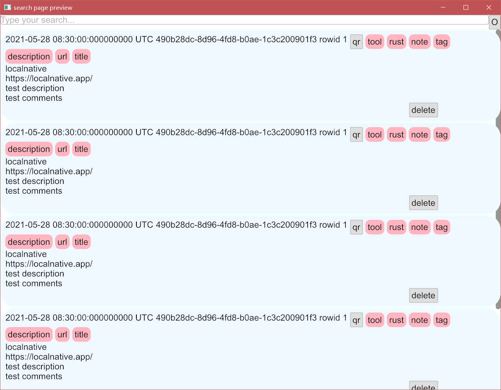
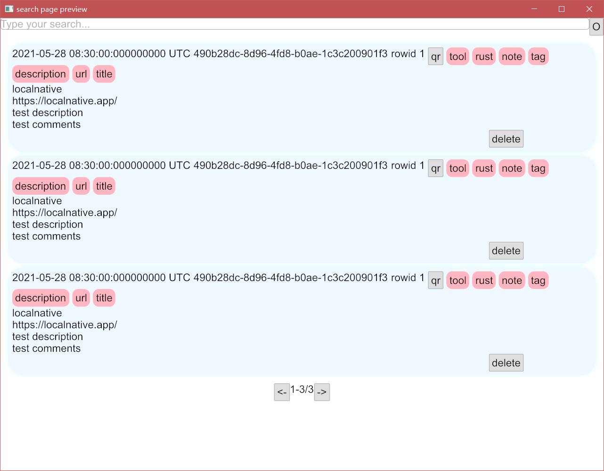
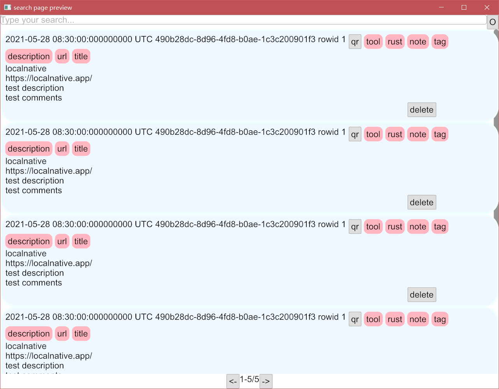
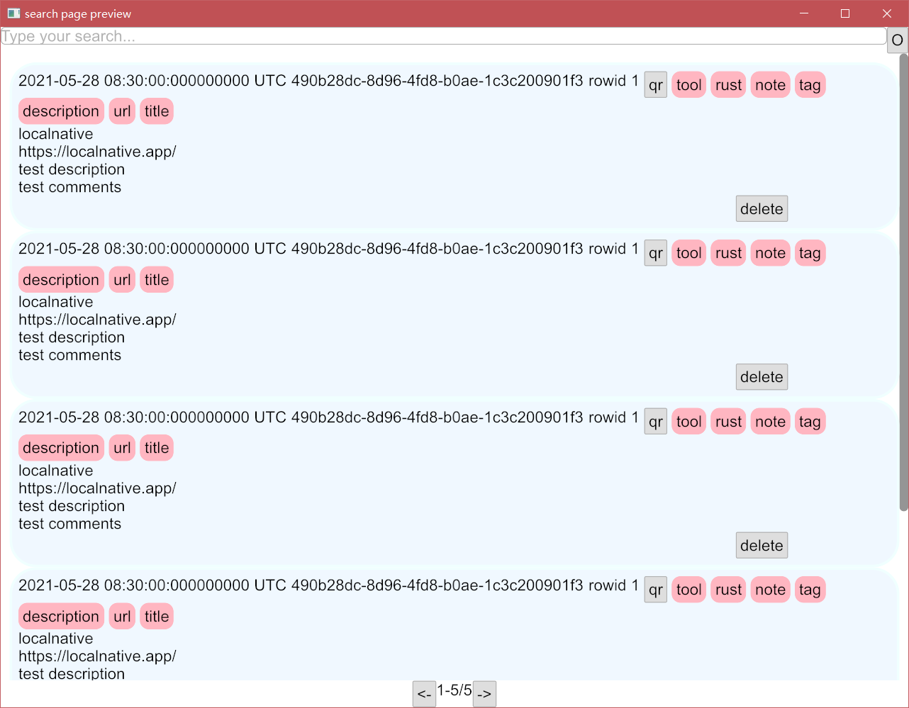
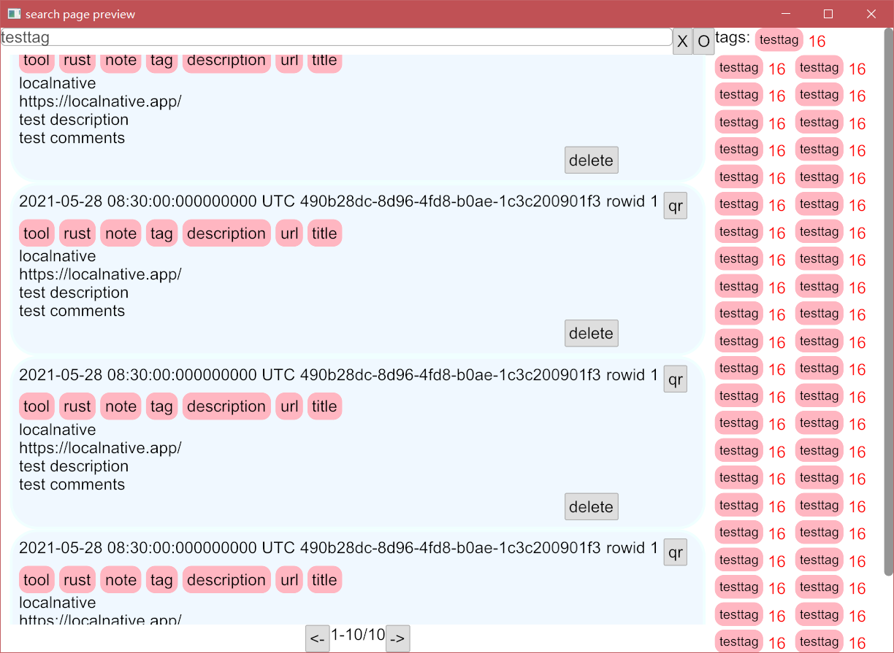
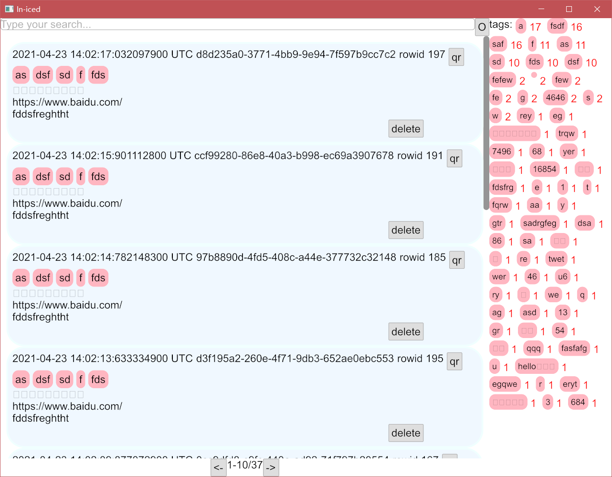

在前几节我们已经实现了`NoteView`和`TagView`两个部分，在这一节里我们将把多个`NoteView`和多个`TagView`组合起来，作为一个更复杂的界面。

### 粗略实现

有了之前实现的经验，我们很容易知道`iced`实现的流程就是通过给指定结构体实现两个主要方法：`view`和`update`。
```rust
use iced::{
    button, scrollable, text_input, Button, Column, Container, Element, Row, Scrollable, Text,
    TextInput,
};

use crate::{
    style::{self, Theme},
    NoteView,
};
// 我们实现的界面是包含搜索，页面信息的一个完整界面
#[derive(Default)]
pub struct SearchPage {
    // 用Vec来保存多个NoteView
    notes: Vec<NoteView>,
    // 这个字段是用来保存搜索值的
    search_value: String,
    // offset是指Note数量偏移
    offset: u32,
    // count是指对应搜索结果的Note数量总数
    count: u32,
    // 以下都是一些iced控件状态
    input_state: text_input::State,
    clear_button: button::State,
    refresh_button: button::State,
    scrollable_state: scrollable::State,
    next_button: button::State,
    pre_button: button::State,
}
// 和之前一样，需要给Message实现Debug
#[derive(Debug)]
pub enum Message {
    // 以下信息不用在意，因为都是通过添加控件的时候添加到这里的
    NoteMessage(crate::note::Message, usize),
    Search,
    SearchInput(String),
    Clear,
    Refresh,
    NextPage,
    PrePage,
}
impl SearchPage {
    // view 方法，除了已经见过的用来控制主题色的theme参数，还多了一个limit参数
    // limit是每页展示的note数，返回值同样是Element<Message>
    pub fn view(&mut self, theme: Theme, limit: u32) -> Element<Message> {
        // 结构语法方便分离所有权
        let Self {
            notes,
            search_value,
            input_state,
            clear_button,
            refresh_button,
            scrollable_state,
            next_button,
            pre_button,
            ..
        } = self;
        // 这是我们第一次用到文本输入控件，需要传递四个参数
        let mut search_bar = Row::new().push(
            TextInput::new(
                input_state,// iced文本输入控件的状态，通过新建self的时候创建即可
                "Type your search...",// 文本输入框的预设内容
                &search_value,// 文本输入框的具体内容，同样是&str类型
                Message::SearchInput,// *1 需要提供一个接收参数为String的Message
            )
            // on_submit是指在输入框下回车时需要对应的Message
            .on_submit(Message::Search),
        );
        // 我们判断以下搜索的文本是否为空，不为空的情况下在搜索输入框一行后面加入清除文本的按钮
        if !self.search_value.is_empty() {
            search_bar =
                search_bar.push(Button::new(clear_button, Text::new("X")).on_press(Message::Clear));
        }
        // 属性按钮
        let refresh_button = Button::new(refresh_button, Text::new("O")).on_press(Message::Refresh);
        search_bar = search_bar.push(refresh_button);
        // 我们调用noteview的view方法,得到对应的Element<note::Message>
        // 并且将其note::Message映射为Message::NoteMessage(note::Message,usize)
        // 此处的usize即对应的note所在Vec的索引位置，通过索引能快速找到该note::Message的来源
        let notes = Container::new(notes.iter_mut().enumerate().fold(
            // 这也是我们第一次使用Scrollabel控件，目前iced的可滑动控件只支持竖向，不支持横向的
            // 用法上和Row,Column没什么大的区别
            Scrollable::new(scrollable_state),
            |notes, (idx, note_view)| {
                notes.push(
                    note_view
                        .view(theme)
                        // map用于转换不同的Message，是iced组合多个部分的重要用法
                        .map(move |note_msg| Message::NoteMessage(note_msg, idx)),
                )
            },
        ));
        // 下一页按钮
        let next_button = Button::new(next_button, Text::new("->")).on_press(Message::NextPage);
        // 上一页按钮
        let pre_button = Button::new(pre_button, Text::new("<-")).on_press(Message::PrePage);
        // 页面信息，和普通的页面信息不太一样，localnative里采用数量来展示页面信息
        // 代表的是从第start个note到第end个note，以及符合条件的总note数量
        let page_info = Text::new(format!(
            "{}-{}/{}",
            self.offset + 1,
            (self.offset + limit).min(self.count),
            self.count
        ));
        // 居中
        let page_ctrl = Row::new()
            .push(style::rule())
            .push(pre_button)
            .push(page_info)
            .push(next_button)
            .push(style::rule());
        // 使用一个Container来包裹我们的整个页面方便后续调整主题
        Container::new(Column::new().push(search_bar).push(notes).push(page_ctrl)).into()
    }
    // 粗略的update实现，甚至没实现完全，部分是直接todo!()
    pub fn update(&mut self, message: Message) {
        match message {
            Message::Search => todo!(),
            Message::SearchInput(search_value) => self.search_value = search_value,
            Message::Clear => self.search_value.clear(),
            Message::Refresh => todo!(),
            Message::NextPage => todo!(),
            Message::PrePage => todo!(),
            // 前几个都是常见的消息处理，这个比较特殊，因为是通过map映射过来的
            // 所以实际处理的时候还是调用对应的noteview的update方法来执行具体操作
            Message::NoteMessage(msg, idx) => match msg {
                crate::note::Message::Delete => todo!(),
                crate::note::Message::Search(s) => self.update(Message::SearchInput(s)),
                // 我们将note能处理的传递给note，不能处理的留在这一层进行处理。
                msg => {
                    if let Some(note) = self.notes.get_mut(idx) {
                        note.update(msg)
                    };
                }
            },
        }
    }
}
// 简易实现Sandbox给SearchPage，通过预览能方便我们快速调试UI界面
#[cfg(feature = "preview")]
impl iced::Sandbox for SearchPage {
    type Message = Message;

    fn new() -> Self {
        // 简单创建5个note进行预览
        let count = 5;
        let mut notes = Vec::with_capacity(count as usize);
        for _ in 0..count {
            notes.push(NoteView::new());
        }
        Self {
            notes,
            offset: 0,
            count,
            ..Default::default()
        }
    }

    fn title(&self) -> String {
        "search page preview".to_owned()
    }

    fn update(&mut self, message: Self::Message) {
        self.update(message)
    }

    fn view(&mut self) -> Element<'_, Self::Message> {
        self.view(Theme::Light, 5)
    }
}

```
 > *1 处，其实函数接口要求传递的参数是：`F: 'static + Fn(String) -> Message`，也就是一个参数为`String`，返回值为`Message`的闭包，`'static`限定了生命期是`'static`，但我们在写的时候，直接传递了一个枚举体进去，也就是说在`Rust`里，你可以将枚举当作闭包来用。
 
 > 关于`'static`：一般理解为带有完整所有权的变量，或者本身就是``static`生命期的变量，后者通常使用`static`关键字、`OnceCell`等方法获取,虽然是`'static`，实际上只要能保证比所在函数存活的时间更久即可。

和前几次一样，我们需要将`SearchPage`给pub出去，同时，还需要再preview内创建`search_page.rs`用于保存预览的可执行文件`main`函数：
```rust
// 在 preview/search_page.rs 内
use iced::Sandbox;
use localnative_iced::SearchPage;

fn main() -> iced::Result {
    SearchPage::run(localnative_iced::settings())
}
```
```diff
// 在 lib.rs 内
    pub use note::NoteView;
++  pub use search_page::SearchPage;
    pub use tags::TagView;
```
```diff
# 在 Cargo.toml 内
++  [[bin]]
++  name = "search_page"
++  path = "./previews/search_page.rs"
++  required-features = ["preview"]
```
接着我们就可以运行我们的搜索页面的预览了：
```shell
cargo run --bin search_page
```
可以得到以下结果：

可以看到这个界面很简陋，我们会在后续一步一步的改进结果，在此之前，有些地方和我们的预期不一致，比如我们明显在页面的下方加入了页面信息的一行，但是并没有显示出来。

出现这个问题的原因是因为我们的notes使用了`Scrollable`控件，同时在其外又包裹了一层`Container`控件，`Container`控件的默认`height`属性是`iced::Length::Shrink`,该字段的官方文档指填充最小空间，就我们当前的用例来说，最小空间已经超过了我们的窗口大小，如果此时你将我们的用例中note的数量5减少为2或3，那你就能看到之前被布局挤压下看不到的页面控制行了：


知道了问题的所在原因，我们现在就来修复这个Bug，修复的方法也很简单，将默认的`height`给改成`Fill`:
```diff
// 在 search_page.rs -> impl SearchPage -> view 内
        let notes = Container::new(notes.iter_mut().enumerate().fold(
            Scrollable::new(scrollable_state),
            |notes, (idx, note_view)| {
                notes.push(
                    note_view
                        .view(theme)
                        .map(move |note_msg| Message::NoteMessage(note_msg, idx)),
                )
            },
--      ));
++		))
++      .height(iced::Length::Fill);
```
改好之后，我们在运行5个note的示例，当前就符合我们的预期了：


除了这个问题之外，还有一个问题也挺明显的，我们的note遮挡住了`Scrollable`的拖动栏，解决的方法也很简单，在创建`Scrollable`的时候，给其指定`padding`，指定的值根据自己的喜好来设置：

```diff
// 在 search_page.rs -> impl SearchPage -> view 内
		let notes = Container::new(notes.iter_mut().enumerate().fold(
--		  Scrollable::new(scrollable_state),
++        Scrollable::new(scrollable_state).padding(10),
            |notes, (idx, note_view)| {
                notes.push(
                    note_view
                        .view(theme)
                        .map(move |note_msg| Message::NoteMessage(note_msg, idx)),
                )
            },
        ))
        .height(iced::Length::Fill);
```
更改后运行：



至此，我们粗略的完成了一个需要组合的页面的搭建，在接下来我们将先实现`update`方法，在大致完成更新方法之后我们再来优化页面样式。

### 实现update

在实现`update`之前，我们要先介绍一下`Command`，在之前实现`lib.rs`的时候，我们有介绍过`Application`这个trait，这是`Sandbox`的完整版本，相较于`Sandbox`的`update`方法，在实现`Application`的时候，其`update`方法需要返回一个`Command`类型。

```rust
// 在 lib.rs > impl Application for LopcalNative 内
    fn update(
        &mut self,
        message: Self::Message,
        clipboard: &mut iced::Clipboard,
    ) -> Command<Self::Message> {
        // 此前我们仅仅返回一个none命令
        iced::Command::none()
    }
```

实际上`Command`除了`none()`方法之外，常用的方法还有`perform()`、`batch()`，其中`perform`需要两个参数，第一个参数是`future: impl Future<Output = T> + 'static + Send,`,我们一般传递异步方法即可，需要注意的是该异步方法必须满足`'static`和`Send`，前者此前已经介绍过了，在这里可以介绍一下`Send`。

说到`Send`就不能不提一下`Sync`，这两个是Rust里常用的两个标记trait，大部分时候不会需要我们手动实现这两个trait，我们只需要知道这两个trait是用来标记在线程间安全传递的即可，其中实现`Send`的结构体能够在线程间安全传递所有权，实现了`Sync`的结构体则可以在线程间安全传递不可变引用，对立的trait分别是`!Send`和`!Sync`，分别是不能在线程间传递所有权，和不能再线程间传递不可变引用。Rust的内建结构体都默认实现了这四个trait中的其中两个，你通过这些结构体组合得到的新的结构体编译器也会默认给你实现其中两个。通常来说如果组成你结构体的所有字段都是`Send`的，你的结构体默认实现的就是`Send`，`Sync`也同理。

说了这么多，实际写的时候不需要考虑的很复杂，我们只需要简单查一下文档，看看需要传递的结构体是否满足需求即可，不满足需求，我们就给它套娃，让它足以满足我们的需求即可。（通常实际连文档都不需要看，编译时不满足需求的情况下编译器会给你贴心的指出来的）

那么问题就来到了，如何将一个不满足需求的结构体转换成满足的结构体呢？社区已经有大量此类转换的文档、图表集合了，当然，再看图表之前，最好先找文档看看，实践一下，熟练了，能一眼看懂图表的时候，再考虑看文档。文档好找，甚至直接看`std.rs`的都可以，图不太好找，在这里贴一下[地址](https://github.com/usagi/rust-memory-container-cs)：https://github.com/usagi/rust-memory-container-cs

`Command::batch()`也很简单，需要的参数就是一个支持迭代器的`Command`集合，我相信通常大家都会这样调用：
```rust
    // 当前Rust版本的错误示范
    fn update(
        &mut self,
        message: Self::Message,
        clipboard: &mut iced::Clipboard,
    ) -> Command<Self::Message> {
        // 返回的Command可以指定为多个，但是以下的调用方式是错误的
        Command::batch(
            // 需要一个实现迭代器的收集器，数组并没有实现into_iter()，查看文档的话，会看到当前版本的Rust调用数组的into_iter()会转换成调用iter()，返回值不是T而是&T
            [
                Command::perform(cmd0(),Message::Cmd0),
                Command::perform(cmd1(),Message::Cmd1),
                Command::perform(cmd2(),Message::Cmd2),
                Command::perform(cmd3(),Message::Cmd3),
            ]
        )
    }
```
```rust
    // 正确示范
    fn update(
        &mut self,
        message: Self::Message,
        clipboard: &mut iced::Clipboard,
    ) -> Command<Self::Message> {
        // 可以直接用vec
        let commands =             
            vec![
                Command::perform(cmd0(),Message::Cmd0),
                Command::perform(cmd1(),Message::Cmd1),
                Command::perform(cmd2(),Message::Cmd2),
                Command::perform(cmd3(),Message::Cmd3),
            ];

        // 或者说在上一种的基础上这样：
        let commands =  
        std::array::IntoIter::new(
            [
                Command::perform(cmd0(),Message::Cmd0),
                Command::perform(cmd1(),Message::Cmd1),
                Command::perform(cmd2(),Message::Cmd2),
                Command::perform(cmd3(),Message::Cmd3),
            ]
        );
        // 两种方法都可以，在不远的将来，你可以直接用array，而不需要通过这种方式来调用
        Command::batch(
            commands
        )
    }
```
好了，介绍了怎么用`Command`之后，我们来说说为什么要用`Command`。考虑一下，如果你正在写一个单线程的GUI界面程序，如果你在UI绘制线程里调用一个可能会在主线程里阻塞的函数，你的应用程序能流畅么？这便是设计`Command`的目的，本质上就是运行时里传递`Spawn`一个`Future`，同时指定这个`Future`的返回值和`Message`的关系，在未来`Future`完成的时候，会通过`channel`将这个结果映射到`Message`之后传递回`update`线程，再在线程内的对应`Message`里处理。

也就是，我们在构建`iced`的应用程序时，最好将重的，容易影响绘制速度的任务，作为异步函数放到运行时里通过`iced`的异步调度器帮我们调度运行，在将来它完成了重量运算之后，会作为一个新的`Message`返回到`update`方法里，因此使用`Command`时，我们还需要写如何处理返回值。

基本的概念都理清了，我们现在可以实现一些异步方法，一些比较中的方法，我们是需要拿到`Command`里去跑的，我们从简单的搜索、删除开始写：
```rust
// 在 middle_data.rs 内
use std::sync::Arc;

use iced::futures::lock::Mutex;
use localnative_core::{
    cmd::{create, delete, insert},
    rusqlite::Connection,
    Note,
};
use serde::{Deserialize, Serialize};

use crate::{days::Day, tags::Tag};

// 这是localnative_core里调用搜索接口返回的json的对应Rust结构体
// 和之前跟json有关的一样，我们需要给其实现Deserialize, Serialize
// 其中一个days字段我们还没见过，它和tags差不多，目前你只需要自己新建一个days.rs
// 并且在其中定义一个这样的结构体即可：
// use serde::{Deserialize, Serialize};

// #[derive(Debug, Default, Deserialize, Serialize, Clone)]
// pub struct Day {
//     #[serde(rename = "k")]
//     pub day: String,
//     #[serde(rename = "v")]
//     pub count: i32,
// }
// 除此之外，不要忘记了在 lib.rs 内，声明days和当前的middle_data两个模块:
// mod days;
// mod middle_data;
#[derive(Debug, Default, Deserialize, Serialize, Clone)]
pub struct MiddleDate {
    pub count: u32,
    pub notes: Vec<Note>,
    pub days: Vec<Day>,
    pub tags: Vec<Tag>,
}

impl MiddleDate {
    // 需要一个&Connection，
    // Connection这个结构体实现了`Send`和`!Sync`，也就是它自己可以在线程间安全传递，但是它的引用却不可以，这很重要，为后续我们定义该字段的时候埋下伏笔。
    fn from_select_inner(
        conn: &Connection,
        query: String,
        limit: u32,
        offset: u32,
    ) -> Option<Self> {
        // 其它几个参数都是localnative_core里需要的，我们跟着声明即可
        let search_result = localnative_core::exe::do_search(conn, &query, &limit, &offset);
        // 返回的结果是字符串，我们需要用序列化工具帮我们从字符串转化到实际的MiddleData结构体
        // 这个过程是有可能出错的，因此serde_json::from_str::<Self>(&search_result)这部分返回的是一个Result，我们不需要关心错误原因，只需要将Result转换为Option即可
        // 也就是当发生任何错误时返回None，正确转换了就返回Some(MiddleData)
        // 从Result到Option只需要调用ok()即可
        serde_json::from_str::<Self>(&search_result).ok()
    }
    // 我们通过调用from_select_inner来帮我们检索需要展示的数据
    // 定义一个异步函数，这里面的步骤都会在运行时的调度下在UI线程外运行
    // 删除一个note需要指定其rowid号，该号码是note的一个字段
    // 和from_select_inner有区别的地方在于此处的conn传递的是Arc和Mutex包裹的
    // 关于Arc和Mutex，Arc是引用计数，不过不是普通的Rc，而是原子引用计数，比Rc更耗性能，但是相对的它可以在多线程间安全使用，而Rc却不可以。使用引用计数的最大问题是可能会遇到循环引用，我们不在此讨论。Mutex是互斥锁，通常情况下使用锁的话，需要考虑是否可能更细粒度化，比如能使用读写锁就不要使用互斥锁，在Rust社区里有各类不同情况下的互斥锁，std的互斥锁通常不是性能最优解，甚至还有专门给异步函数设计的互斥锁，我们此处使用iced官方提供的互斥锁即可。
    pub async fn delete(
        conn: Arc<Mutex<Connection>>,
        query: String,
        limit: u32,
        offset: u32,
        rowid: i64,
    ) -> Option<Self> {
        // 异步互斥锁的使用，需要先锁住，同时因为lock这个操作并不是百分百成功，因此在异步操作里，lock这个函数编程了异步的，也就是只有锁住了才会接着往下执行。
        let conn = &*conn.lock().await;
        //得到conn之后，调用localnative_core内的delete方法（具体路径看顶部）
        delete(conn, rowid);
        // 最后返回检索结果
        Self::from_select_inner(conn, query, limit, offset)
    }
    // 同删除，只是将删除的步骤更改为更新
    pub async fn upgrade(
        conn: Arc<Mutex<Connection>>,
        query: String,
        limit: u32,
        offset: u32,
        is_created_db: bool,
    ) -> Option<Self> {
        let conn = &*conn.lock().await;
        if !is_created_db {
            create(conn);
        }
        if let Ok(version) = localnative_core::upgrade::upgrade(conn) {
            println!("upgrade done:{}", version);
        } else {
            println!("upgrade error");
        }
        Self::from_select_inner(conn, query, limit, offset)
    }
    // 实际上目前用不到的插入方法，考虑到后续很有可能会加入增改tag功能，因此保留到了教程内
    // 关于为啥不用update，而是insert，因为localnative_core内部有个分布式框架，在不同设备间同步时是通过rowid号来进行判断是否存在，目前没有改动后端的动力，因此实际上做更新是需要删除对应rowid的note之后再插入新的note，这也是这个insert内部有delete的原因。
    // 我们暂时不会用到，所以，你甚至可以不需要这个方法。
    pub async fn insert(
        conn: Arc<Mutex<Connection>>,
        query: String,
        limit: u32,
        offset: u32,
        rowid: i64,
        note: Note,
    ) -> Option<Self> {
        let conn = &*conn.lock().await;
        delete(conn, rowid);
        insert(note);
        Self::from_select_inner(conn, query, limit, offset)
    }
    // 简单的检索
    pub async fn from_select(
        conn: Arc<Mutex<Connection>>,
        query: String,
        limit: u32,
        offset: u32,
    ) -> Option<Self> {
        let conn = &*conn.lock().await;
        Self::from_select_inner(conn, query, limit, offset)
    }

}
```

距离我们实现`update`又进了一步，我们完成了一个简单的前后端交互，现在可以将这些异步函数放到我们的`update`里去了。

```rust
// 在 search_page.rs > impl SearchPage 内
// 在实现Debug，Clone的过程中，需要给MiddleDate，以及middleDate内相关结构体实现Debug和Clone
// Debug是最小限定，Clone是在某些情况下，比如使用按钮控件时的点击事件就需要Clone
#[derive(Debug，Clone)]
pub enum Message {
    Receiver(Option<MiddleDate>),
    NoteMessage(crate::note::Message, usize),
    Search,
    SearchInput(String),
    Clear,
    Refresh,
    NextPage,
    PrePage,
}
// 具体实现前，我们定义一个函数，帮我们减少代码量
// *1 后续会多次调用从数据库检索绘制UI需要的数据，因此直接抽象为一个函数
fn search(
    conn: Arc<Mutex<Connection>>,
    query: String,
    limit: u32,
    offset: u32,
) -> Command<Message> {
    Command::perform(
        MiddleDate::from_select(conn, query, limit, offset),
        Message::Receiver,
    )
}

impl SearchPage {
    // 直接将此前的update方法删除，我们需要一个新的函数签名：
    pub fn update(
        &mut self,
        message: Message,
        limit: u32,
        conn: Arc<Mutex<Connection>>,
    ) -> Command<Message> {
        // 相对于之前的函数签名，我们多了limit和conn两个参数，其中conn要保存到Data内，现在我们不急，可以暂且不用管Data那边。
        // 除此之外还有一个limit参数，这是用来限制默认页面展示note的最大数量的，这个值也可以写死，比如使用10来代替，但是考虑到后续设置部分能够更改这个参数，因此作为一个值转递进来。
        // 大部分实现都很简单，我们直接看最后几条即可
        match message {
            Message::Search => search(conn, self.search_value.to_owned(), limit, self.offset),
            Message::SearchInput(search_value) => {
                self.search_value = search_value;
                search(conn, self.search_value.to_owned(), limit, self.offset)
            }
            Message::Clear => {
                self.search_value.clear();
                search(conn, self.search_value.to_owned(), limit, self.offset)
            }
            Message::Refresh => search(conn, self.search_value.to_owned(), limit, self.offset),
            Message::NextPage => {
                let current_count = self.offset + limit;
                if current_count < self.count {
                    self.offset = current_count;
                    search(conn, self.search_value.to_owned(), limit, self.offset)
                } else {
                    Command::none()
                }
            }
            Message::PrePage => {
                if self.offset >= limit {
                    self.offset -= limit;
                    search(conn, self.search_value.to_owned(), limit, self.offset)
                } else if self.offset != 0 {
                    self.offset = 0;
                    search(conn, self.search_value.to_owned(), limit, self.offset)
                } else {
                    Command::none()
                }
            }
            // 在处理下一层的msg时可以先判断是否需要在当前层处理
            // 将不需要在当前层处理的扔回下一层去处理即可
            Message::NoteMessage(msg, idx) => match msg {
                crate::note::Message::Delete(rowid) => Command::perform(
                    MiddleDate::delete(
                        conn,
                        self.search_value.to_string(),
                        limit,
                        self.offset,
                        rowid,
                    ),
                    Message::Receiver,
                ),
                crate::note::Message::Search(s) => {
                    self.search_value = s;
                    search(conn, self.search_value.to_owned(), limit, self.offset)
                }
                msg => {
                    if let Some(note) = self.notes.get_mut(idx) {
                        note.update(msg)
                    };
                    Command::none()
                }
            },
            Message::Receiver(_) => {
                // 上层处理
            }
        }
    }
    // ... 其它方法
}

```
 > *1 为什么不直接在update方法里使用闭包？
 
 >  使用闭包确实可以满足需求，但是也会造成一些困扰，比如conn在构建闭包的时候必须clone,因为Rust编译器判断到了后续还用到了conn这个参数，所有权会有问题（实际上并不会影响所有权，但是目前编译器并没有那么聪明）。为了借用检查器的相关问题，我们使用函数的方式来抽象代码。

实现了新的`update`之后，我们之前的预览也不能直接用了，需要做一些更改，我们没必要单独给SearchPage实现`Application`，只需要将此前的`update`参数补全即可：
```diff
// 在 search_page.rs > impl iced::Sandbox for SearchPage 内
    fn update(&mut self, message: Self::Message) {
--      self.update(message, 5)
++      let conn = localnative_core::exe::get_sqlite_connection();
++      self.update(message, 5, Arc::new(Mutex::new(conn)));
    }
```
当前的预览已经不满足我们对数据库的测试支持了，不过也和此前的预期一致，预览用于对UI进行精修和测试，而更深层次的测试不需要通过预览来做。

至此，我们实现好了新的`update`方法，但是在预览中却没有对应的命令执行，因为`Sandbox`提供的`update`并不支持`Command`，为了更好的测试新的`Command`，我们将在接下来将`SearchPage`集成到`lib.rs`的`Data`中去。在此之前，我们还有两件小事需要做，一个是将tags界面补充到`SearchPage`中，并进行消息处理。第二件是当`count`为零时不现实页面控制行，同时在搜索页面内显示相关提示。

### 集成tags到SearchPage

```diff
// 在 search_page.rs 内
#[derive(Default)]
pub struct SearchPage {
    pub notes: Vec<NoteView>,
++  pub tags: Vec<TagView>,
    search_value: String,
    pub offset: u32,
    pub count: u32,
    input_state: text_input::State,
    clear_button: button::State,
    refresh_button: button::State,
    // 我们需要一个可滑动空间帮助我们滑动tags
--  scrollable_state: scrollable::State,
++  notes_scrollable: scrollable::State,
++  tags_scrollable: scrollable::State,
    next_button: button::State,
    pre_button: button::State,
}
#[derive(Debug,Clone)]
pub enum Message {
    Receiver(Option<MiddleDate>),
    NoteMessage(crate::note::Message, usize),
++  TagMessage(crate::tags::Message),
    Search,
    SearchInput(String),
    Clear,
    Refresh,
    NextPage,
    PrePage,
}
impl SearchPage {
    pub fn view(&mut self, theme: Theme, limit: u32) -> Element<Message> {
        let Self {
            notes,
++          tags,
            search_value,
            input_state,
            clear_button,
            refresh_button,
--          scrollable_state,
++          notes_scrollable,
++          tags_scrollable,
            next_button,
            pre_button,
            ..
        } = self;
        // ...其它实现
++      let tags = Scrollable::new(tags_scrollable).push(
++          Container::new(tags.iter_mut().fold(
++              iced_aw::Wrap::new().spacing(5).push(Text::new("tags:")),
++              |tags, tag| tags.push(tag.view(theme).map(Message::TagMessage)),
++          )),
        // 我们给宽度顶一个值，和后面的Note栏形成一个8，2开
++      ).width(iced::Length::FillPortion(2));
        // 判断count数，当大于零的时候返回正常的note页面
++      let note_page = if self.count > 0 {
            let notes = Container::new(notes.iter_mut().enumerate().fold(
                Scrollable::new(notes_scrollable).padding(10),
                |notes, (idx, note_view)| {
                    notes.push(
                        note_view
                            .view(theme)
                            .map(move |note_msg| Message::NoteMessage(note_msg, idx)),
                    )
                },
            ))
            .height(iced::Length::Fill);
            let next_button = Button::new(next_button, Text::new("->")).on_press(Message::NextPage);
            let pre_button = Button::new(pre_button, Text::new("<-")).on_press(Message::PrePage);
            let page_info = Text::new(format!(
                "{}-{}/{}",
                self.offset + 1,
                (self.offset + limit).min(self.count),
                self.count
            ));
            let page_ctrl = Row::new()
                .push(style::rule())
                .push(pre_button)
                .push(page_info)
                .push(next_button)
                .push(style::rule());

++          Column::new().push(search_bar).push(notes).push(page_ctrl)
            // 小于等于零的时候返回提示
++        } else {
++          let tip = if self.search_value.is_empty() {
++              "Not Created"
++          } else {
++              "Not Founded"
++          };
++          Column::new()
++              .push(search_bar)
++              .push(style::vertical_rule())
++              .push(Text::new(tip).size(50))
++              .push(style::vertical_rule())
++      }
++      .align_items(iced::Align::Center)
++      .width(iced::Length::FillPortion(8));
--      Container::new(Column::new().push(search_bar).push(notes).push(page_ctrl)).into()
++      Container::new(Row::new().push(note_page).push(tags)).into()
    }
    pub fn update(
        &mut self,
        message: Message,
        limit: u32,
        conn: Arc<Mutex<Connection>>,
    ) -> Command<Message> {
        match message {
            // 和 note_message 一样处理即可
++          Message::TagMessage(tag_msg) => {
++              match tag_msg {
++                  crate::tags::Message::Search(text) => self.search_value = text,
++              }
++              search(conn, self.search_value.to_owned(), limit, self.offset)
++          }
            // ...其它message
        }
    // ...其它方法
}
#[cfg(feature = "preview")]
impl iced::Sandbox for SearchPage {
    type Message = Message;

    fn new() -> Self {
        let count = 10;
        let mut notes = Vec::with_capacity(count as usize);
        for _ in 0..count {
            notes.push(NoteView::new());
        }
++      let tags = vec![
++          Tag {
++              name: "testtag".to_owned(),
++              count: 16,
++          };
++          50
++      ]
++       .into_iter()
++      .map(TagView::from)
++      .collect();
        Self {
            notes,
++          tags,
            offset: 0,
            count,
            ..Default::default()
        }
    }
    // ... 其它方法
}
```
 > 其中用到了`vertical_rule`这个函数，我们此前的`rule`是横向的，但现在需要一个竖向的，为了更清晰的区别这两个函数，我们将此前的`rule`改为`horizontal_rule`，并且按照同样的方法声明这个函数：
 ```rust
 // 此前是rule
pub fn horizontal_rule() -> iced::Rule {
    iced::Rule::horizontal(0).style(TransparentRule)
}
// 此前是rules
pub fn horizontal_rules<'a, Msg: 'a>(n: usize) -> Vec<Element<'a, Msg>> {
    let mut res = Vec::with_capacity(n);
    for _ in 0..n {
        res.push(horizontal_rule().into());
    }
    res
}
pub fn vertical_rule() -> iced::Rule {
    iced::Rule::vertical(0).style(TransparentRule)
}
pub fn vertical_rules<'a, Msg: 'a>(n: usize) -> Vec<Element<'a, Msg>> {
    let mut res = Vec::with_capacity(n);
    for _ in 0..n {
        res.push(vertical_rule().into());
    }
    res
}
 ```

 注意，请使用ide自带的`重命名符号`功能来更改，这样更改之后是整个工作区间的命名自动更改，只需要我们保存确认即可，因为变动的幅度过大，此处不展示被更名的各个位置。

修改之后运行,得到结果：



### 集成到lib.rs

经过上面的实现之后，我们已经将大部分功能都实现了，但是还没有实际和数据库进行交互，在本节中，我们将把`SearchPage`集成到lib.rs内的`Data`中去。

```diff
// 在 lib.rs 内
++ use middle_date::MiddleDate;
--  #[derive(Default)]
    pub struct Data {
++      search_page: SearchPage,
++      conn: Arc<Mutex<Connection>>,
++      theme: Theme,
++      limit: u32,
    }
// 简单给Message新增几个Message
#[derive(Debug)]
pub enum Message {
--  NoteMessage(note::Message),
--  TagsMessage(tags::Message),
++  Loading(()),
++  SearchPageMessage(search_page::Message),
++  NoteView(Vec<NoteView>),
++  TagView(Vec<TagView>),
}
```
我们给`Data`新增了几个字段，其中theme、limit字段后续我们将会移到`Config`内去，现在我们还没有定义`Config`暂时先放到这里。

新增的`Message`中，`Loading`和`Config`相关，目前尚未定义`Config`，将会到之后再添加。

我们将之前的`Application`重新实现：

```rust
// 在 lib.rs 内
// 和之前对比，主要是new、view、update有所变化
impl iced::Application for LocalNative {
    type Executor = iced::executor::Default;

    type Message = Message;

    type Flags = ();

    fn new(flags: Self::Flags) -> (Self, Command<Self::Message>) {
        (
            LocalNative::Loading,
            // 当前我们的Command是暂且执行一个空异步函数，后续添加Config之后将从配置文件读取构建Data所需要的数据
            Command::perform(async {}, Message::Loading),
        )
    }

    fn title(&self) -> String {
        "ln-iced".to_owned()
    }

    fn update(
        &mut self,
        message: Self::Message,
        clipboard: &mut iced::Clipboard,
    ) -> Command<Self::Message> {
        // 处理 message 和之前稍有不同，需要先判断self自身的状态，再进行处理nessage
        match self {
            LocalNative::Loading => match message {
                Message::Loading(..) => {
                    let conn = Arc::new(Mutex::new(get_sqlite_connection()));
                    let data = Data {
                        search_page: Default::default(),
                        conn,
                        theme: Theme::Light,
                        limit: 10,
                    };
                    // 简单构建一个Data，其中theme和limit将在之后调整到Config内，届时我们将通过Loading读取到Config，然后由Config获取Data
                    // 获取Data之后切换self的状态，
                    *self = LocalNative::Loaded(data);
                    if let LocalNative::Loaded(data) = self {
                        //接着我们返回一个Command，和Element一样，Command同样提供了map方法用来映射Message
                        // 这里我们返回的是刷新命令，因为此前的Data是一个默认的，需要从数据库内获取数据
                        data.search_page
                            .update(search_page::Message::Refresh, data.limit, data.conn.clone())
                            .map(Message::SearchPageMessage)
                    } else {
                        // 一般这里是不可能触发的,我们用unreachable宏来标识这里。
                        unreachable!()
                    }
                }
                // 该状态的其它message不用再处理
                _ => Command::none(),
            },
            // 加载到了数据时，如何处理Message
            LocalNative::Loaded(data) => match message {
                Message::SearchPageMessage(search_page_msg) => match search_page_msg {
                    // 将此前遗留到上层处理的message优先处理，预留一个问题，为什么这个message不在SearchPage层进行处理？
                    search_page::Message::Receiver(Some(md)) => {
                        let MiddleDate {
                            tags,
                            notes,
                            count,
                            days,
                        } = md;
                        // 我们将count置为从数据库获取的最新值
                        data.search_page.count = count;
                        // 执行一些 Command
                        Command::batch(IntoIter::new([
                            Command::perform(
                                // 在将获取的Tag变为TagView之前，还需要排序处理
                                async move {
                                    let mut tags = tags;
                                    tags.sort_by(|a, b| b.count.cmp(&a.count));
                                    tags.into_iter().map(TagView::from).collect()
                                },
                                Message::TagView,
                            ),
                            // 简单将Note转换为NoteView
                            Command::perform(
                                async move { notes.into_iter().map(NoteView::from).collect() },
                                Message::NoteView,
                            ),
                        ]))
                    }
                    // 其它message传递给下层，不要忘记映射返回的Command为当前的Message
                    msg => data
                        .search_page
                        .update(msg, data.limit, data.conn.clone())
                        .map(Message::SearchPageMessage),
                },
                // 处理接收到的notes
                Message::NoteView(notes) => {
                    data.search_page.notes = notes;
                    Command::none()
                }
                // 处理接收到的tags
                Message::TagView(tags) => {
                    data.search_page.tags = tags;
                    Command::none()
                }
                // 暂时不需要我们进行加载处理
                Message::Loading(..) => Command::none(),
            },
        }
    }

    fn view(&mut self) -> iced::Element<'_, Self::Message> {
        match self {
            // 加载页面当前很快就略过了，不排除在性能不是很好的机器上会长时间加载，因此加载部分我们也简单设计了一个页面
            LocalNative::Loading => Column::new()
                .push(style::vertical_rule())
                .push(
                    Row::new()
                        .push(style::horizontal_rule())
                        .push(Text::new("Loading...").size(50))
                        .push(style::horizontal_rule()),
                )
                .push(style::vertical_rule())
                .into(),
            LocalNative::Loaded(data) => {
                // 目前简单调用search_page的view方法即可，后续会加入设置等其它界面
                let Data { search_page, .. } = data;
                search_page
                    .view(data.theme, data.limit)
                    .map(Message::SearchPageMessage)
            }
        }
    }
}
```
完成这部分集成之后，运行我们的程序：
```shell
cargo run --bin ln
```
你可以看到以下结果：


什么？你的程序里没有数据？是空白的？那就对了，你本身就没有向数据库写入过数据，所以是空白的，这很合理。如何解决这个问题呢？

简单的解决方式：安装LocalNative 桌面软件 -> 安装LocalNative 浏览器插件 -> 打开桌面软件 -> 打开浏览器插件随意新增Note

复杂的解决方式： 我们在此前写localnative_core交互的接口时，有写道insert方法，你可以简单做一个preview程序，通过外部调用insert，给数据库插入用于测试的一些数据。

还有一个方法，拷贝一个已经存有相关数据的sqlite文件放入到合适的位置（目前读取文件是在：/home/LocalNative/localnative.sqlite3）,将它也替换即可。在LocalNative的项目里已经准备好了一个用于测试的sqlite3文件，下载更改名字替换即可。链接在这：（TODO）

 > 预留的问题，为什么这个`message`不再下一层处理，而在这层处理，最大的原因是因为`NoteView`结构体包含诸如`QRCode`的不可Clone的状态，因此如果我们需要使用`Message`来接收一个不可克隆的数据时，会造成更多的麻烦，我们将可克隆的放在下一层，而不可克隆的留在本层处理，就不会遇到更多的问题。

 由结果图已经可以看出还存在不少问题，比如太丑了，比如中文乱码，我们将在下一章对界面做一个整体的美化，让界面变得稍微好看点，同时会解决中午乱码的问题，以及添加图标替换掉当前部分过于丑陋的按钮。