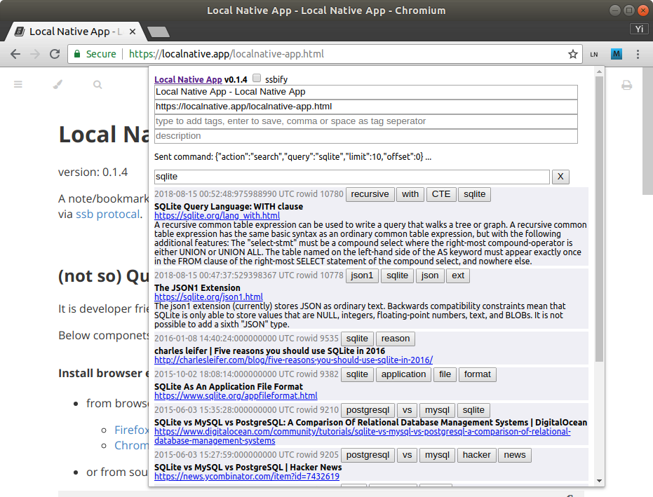
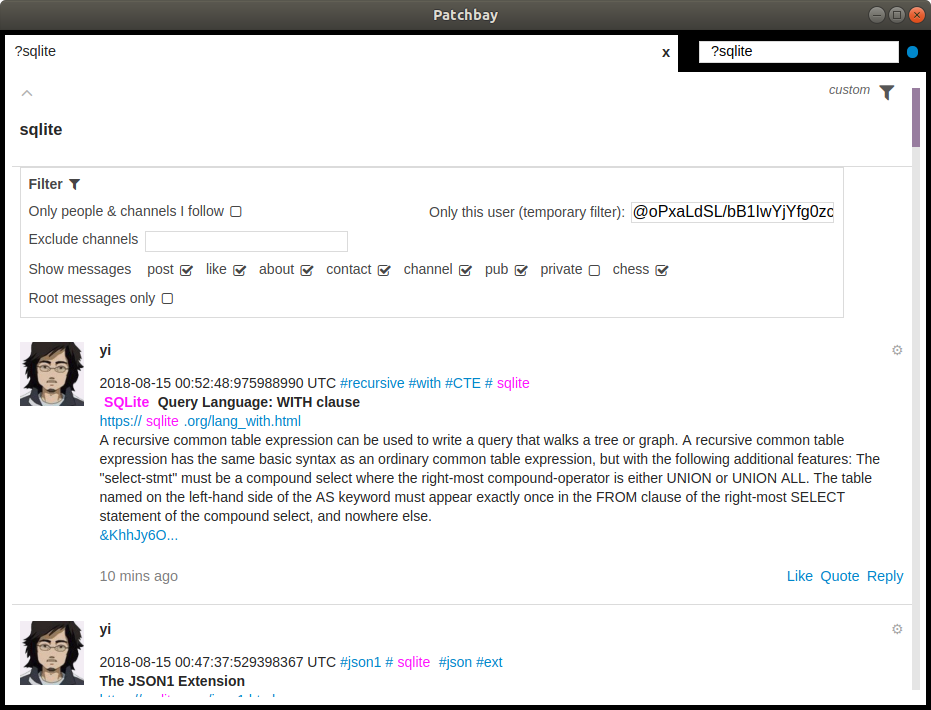

 <b style="margin-top: 20px;font-size:120%; float: right">Organize your information and make it locally accessible and useful.</b>

|            | ios | android | | firefox addon | chrome extension | | gnu linux | mac | 
|------------|-----|---------|-|----------------- |---------------------|-|--------------|-----|
| <b>mobile</b> | [<i class="fab fa-apple fa-3x"></i>](https://itunes.apple.com/us/app/local-native/id1443968309) | [<i class="fab fa-android fa-3x"></i>](https://play.google.com/store/apps/details?id=app.localnative) | <b>browser extension</b> | [<i class="fab fa-firefox fa-3x"></i>](https://addons.mozilla.org/en-US/firefox/addon/localnative/) | [<i class="fab fa-chrome fa-3x"></i>](https://chrome.google.com/webstore/detail/local-native/oclkmkeameccmgnajgogjlhdjeaconnb) | <b>desktop</b> | [<i class="fab fa-linux fa-3x"></i>](https://gitlab.com/yiwang/localnative-release/tree/master/v0.3.7/gnu-linux) | [<i class="fab fa-app-store fa-3x"></i>](https://gitlab.com/yiwang/localnative-release/tree/master/v0.3.7/mac) |

<b>Local Native</b> [Quick Start](quick-start.md) and [Videos](videos.md).
<iframe width="560" height="315" src="https://www.youtube-nocookie.com/embed/DBsVscpSp6w" frameborder="0" allow="accelerometer; autoplay; encrypted-media; gyroscope; picture-in-picture" allowfullscreen></iframe>

## Own your data on your device
[Local Native App](https://localnative.app) is a cross-platform tool to save and sync your notes in local SQLite database without going through any centralized service.

You can copy the SQLite database file from mobile device to desktop device via [File Sharing](https://support.apple.com/en-us/HT201301) and vice versa.

### sync via ssb
On desktop, with proper web extension and host setup, you can replicate your data with other devices via [ssb](https://www.scuttlebutt.nz) [protocal](https://ssbc.github.io/scuttlebutt-protocol-guide/).

By default, note is your private message in ssb, you can also publish public note to ssb if you explictly choose so.

## Screenshot
### Web extension

### Search your notes in patchbay

